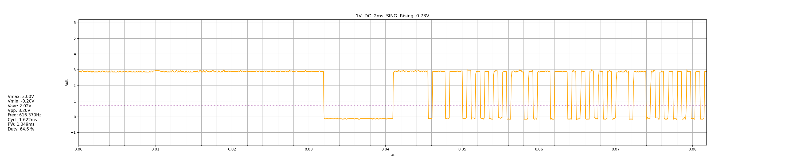

# DSO138 / DSO138mini serial data viewer

Simple script to retrieve and view waveform data from a DSO138 portable 
oscilloscope running the stock firmware.


<div style="text-align: center;"><em>Sample capture from an IR remote control receiver</em></div>

## Usage

```bash
pip install -r requirements.txt
python3 ./dso138.py /path/to/ttyUSBX
```

A `matplotlib` graph will open. If your scope is connected, hold the SEL
button to send the data and view it.

You can send as many times as you want without restarting it.

## License

GNU General Public License v3.0

